# 计算机图形学 系统使用说明书

## 命令行系统

### 基本信息

* 开发语言：Python3

* 运行依赖：Pillow（Python Image Library）

* 包含文件：
  * KDraw_CLI.py
  * instruction.py
  * Kdraw.py

### 使用方法

如果没有安装Python，请先安装之，并同时确保已经安装pip。

如果没有安装Pillow，请使用pip进行安装：

```python
pip install pillow
```


在终端中打开文件所在目录，并按如下格式运行：

```powershell
python KDraw_CLI.py <指令文件> [储存目录]
```

指令文件中的指令格式于下附。若储存目录不填写，则默认为当前目录。


### 指令文件格式

指令文件需要按行编写指令，允许空行，不允许注释。

#### 重置画布

```
resetCanvas <width: int> <height: int>
```

将画布尺寸重置为宽度为`width`，高度为`height`，并清除所有已绘制的图形。宽度和高度的允许范围都是100~1000。

应当注意，画布以左下角为原点，x轴向右，y轴向下！

#### 保存画布

```
saveCanvas <filename: string>
```

将画布保存为`filename`，路径由运行时指定，默认为当前目录。只允许保存为`.bmp`格式的文件，若不填写文件后缀则会自动补全。

#### 设置画笔颜色

```
setColor <R: int> <G: int> <B: int>
```

将画笔颜色设置为指定的RGB值。所有值的范围都在0~255内。

#### 绘制直线

```
drawLine <id: int> <x1: float> <y1: float> <x2: float> <y2: float> <algorithm: DDA|Bresenham>
```

以(`x1`, `y1`)和(`x2`, `y2`)为线段两端绘制一条直线。`id`不可以和已有的重复。提供的绘制算法有`DDA`和`Bresenham`。

#### 绘制多边形

```
drawPolygon <id: int> <n: int> <algorithm: DDA|Bresenham>
<x1: float> <y1: float> ... <xn: float> <yn: float>
```

命令分为两行，第一行指定多边形顶点的个数`n`，且`id`不可以和已有的重复。提供的绘制算法有`DDA`和`Bresenham`。

第二行指定多边形`n`个顶点的坐标(`x1`, `y1`), ..., (`xn`, `yn`)。

#### 绘制椭圆

```
drawEllipse <id: int> <x: float> <y: float> <rx: float> <ry: float>
```

以(`x`, `y`)为椭圆中心，`rx`为x长轴半径，`ry`为y长轴半径绘制一个椭圆。`id`不可以和已有的重复。

#### 绘制曲线

```
drawCurve <id: int> <n: int> <algorithm: Bezier|B-spline>
<x1: float> <y1: float> ... <xn: float> <yn: float>
```

命令分为两行，第一行指定曲线控制点的个数`n`，且`id`不可以和已有的重复。提供的绘制算法有贝塞尔曲线`Bezier`和B样条曲线`B-spline`。

第二行指定曲线`n`个控制点的坐标(`x1`, `y1`), ..., (`xn`, `yn`)。

#### 平移变换

```
translate <id: int> <dx: float> <dy: float>
```

对编号为`id`的图元进行平移，偏移量为(`dx`, `dy`)。

#### 旋转变换

```
rotate <id: int> <x: float> <y: float> <r: float>
```

对编号为`id`的图元进行旋转，旋转中心为(`x`, `y`)，旋转角度为`r`。

应当注意：旋转角度的数值为角度而非弧度，且椭圆不可以作为旋转的对象。

#### 缩放变换

```
scale <id: int> <x: float> <y: float> <s: float>
```

对编号为`id`的图元进行一致缩放，缩放中心为(`x`, `y`)，缩放倍数为`s`。

#### 线段裁剪

```
clip <id: int> <x1: float> <y1: float> <x2: float> <y2: float> <algorithm: Cohen-Sutherland|Liang-Barsky>
```

以(`x1`, `y1`)为裁剪窗口左下角，(`x2`,  `y2`)为右上角，使用`Cohen-Sutherland`或`Liang-Barsky`算法对对编号为`id`的线段进行裁剪。因本操作是线段裁剪，所以只能对线段图元操作，多边形、椭圆、曲线均不能被裁剪。

### 使用示例

#### 绘制不同颜色的直线

```
resetCanvas 100 100
setColor 255 0 0
drawLine 5 7 39 93 71 Bresenham
setColor 0 162 232
drawLine 233 96 35 15 58 DDA
saveCanvas line
```

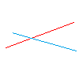

#### 绘制多边形并对其平移、旋转、缩放

```
resetCanvas 100 100
setColor 0 0 0
drawPolygon 666 6 Bresenham
44 22 73 30 74 77 59 56 32 63 25 49
setColor 0 255 255
drawPolygon 667 6 Bresenham
44 22 73 30 74 77 59 56 32 63 25 49
setColor 255 0 255
drawPolygon 668 6 Bresenham
44 22 73 30 74 77 59 56 32 63 25 49
setColor 255 255 0
drawPolygon 669 6 Bresenham
44 22 73 30 74 77 59 56 32 63 25 49
rotate 667 59 56 90
translate 668 -28 -18
scale 669 50 50 2
saveCanvas polygon
```

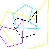

#### 绘制椭圆与曲线

```
resetCanvas 160 100
setColor 255 0 0
drawCurve 10 4 Bezier
28 34 9 86 61 4 129 42
setColor 0 255 0
drawCurve 11 4 B-spline
28 34 9 86 61 4 129 42
setColor 0 0 255
drawEllipse 12 50 50 10 20
saveCanvas el_cu
```

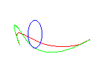

#### 线段裁剪

```
resetCanvas 100 100
setColor 255 0 0
drawLine 5 7 39 93 71 Bresenham
setColor 0 255 0
drawLine 6 96 35 15 58 DDA
saveCanvas before
clip 5 30 40 60 60 Liang-Barsky
clip 6 30 40 60 60 Cohen-Sutherland
saveCanvas after
```

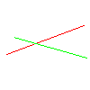

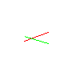

## 图形界面系统

### 基本信息

* 开发语言：Python
* 运行依赖：PyQt5
* 包含文件：
  * 功能文件：KDraw_GUI.py
  * 资源文件：paint.ico

### 启动方法

对于未打包编译的二进制文件，首先确保已安装PyQt5。然后打开文件目录，直接运行文件：

```
python KDraw_GUI.py
```

对于已打包好的.exe文件，不需安装依赖，直接运行即可。

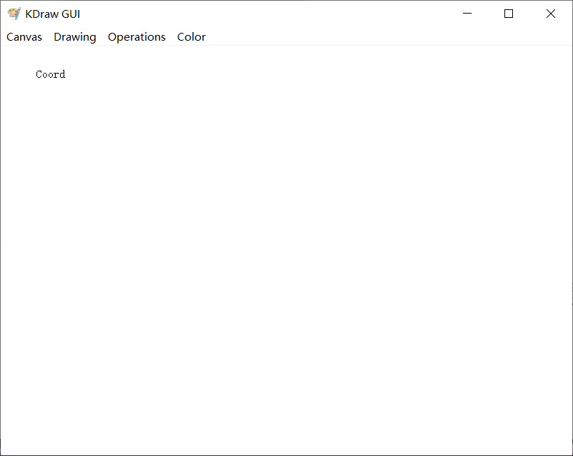

### 使用方法

#### 重置与保存画布

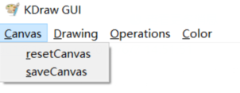

选择resetCanvas，则会弹出两个对话框，要求输入新画布的宽度和高度，范围在100~1000。如果取消，则不会重置画布。

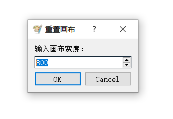

选择saveCanvas，会打开文件保存对话框，选定目录，填写文件名即可。

#### 选择颜色

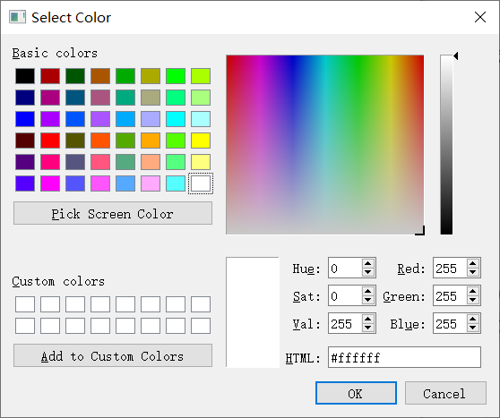

颜色使用Qt自带的颜色选择对话框。


#### 绘制图形

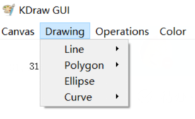

可供绘制的图形有四类：直线，多边形，椭圆，曲线。

----

对于直线，选择算法后，在画布上点击、拖拽即可。

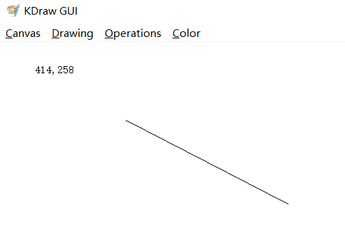

----

对于多边形，选择算法后，点击、拖拽绘制出第一条边，此后点击或拖拽都可绘制下一条边。

如果需要闭合多边形，双击最后的控制点或手动点击初始点即可。

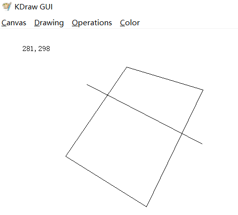

----

对于椭圆，点击、拖拽，即可绘制出指定矩形区域的内切椭圆。

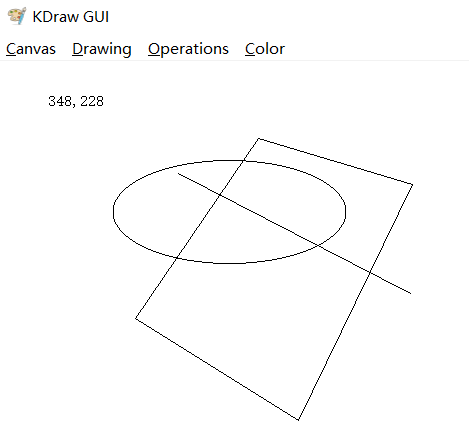

----

对于曲线，选择算法后，先点击、拖拽绘制出一条直线，然后点击、拖拽确定第一个控制点，再点击、拖拽确定第二个控制点，完成绘制。

贝塞尔曲线：

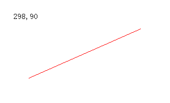

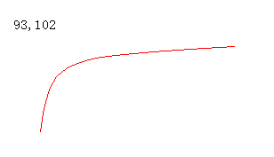

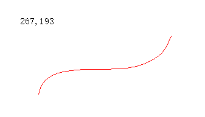

B样条曲线：

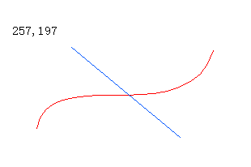

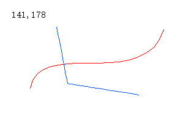

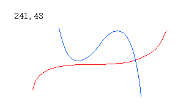

#### 变换操作

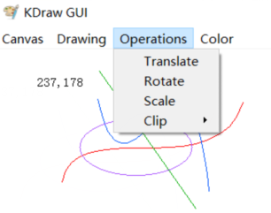

进行变换操作前，首先要保证存在可供操作的图元，否则会提示无可操作图元。

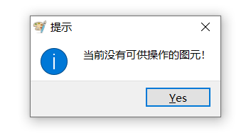

----

除裁剪外，所有的变换操作都需要先选择图元。选择的时候会有虚线框指明选中的图元。

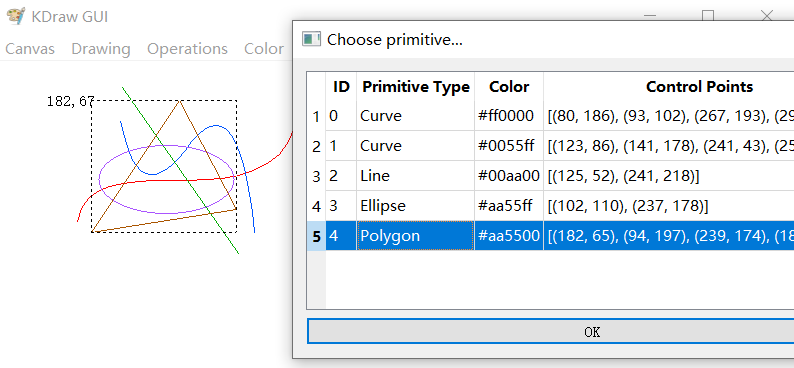

选择后，双击或点击OK即可完成选择，并进行下一步操作。

----

对于平移，直接在画布上拖拽即可。如果希望结束平移，只需单击画布即可。

----

对于旋转，首先单击屏幕确定旋转中心，此时会有一个小点指明旋转中心的位置：

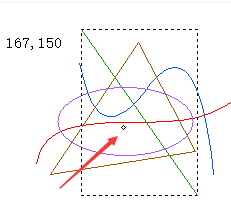

然后拖拽即可。

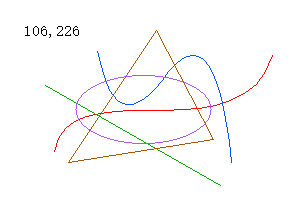

如果选择了椭圆，会提示不可操作：

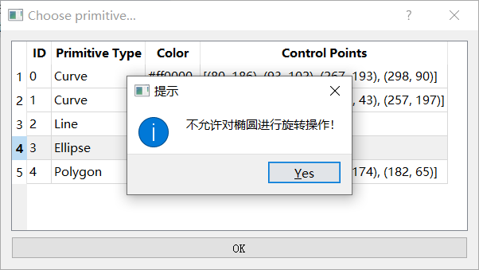

----

对于缩放，同样和旋转一样先指明旋转中心。但是缩放倍数通过对话框指定。限定了缩放倍数为0.1~5.0。

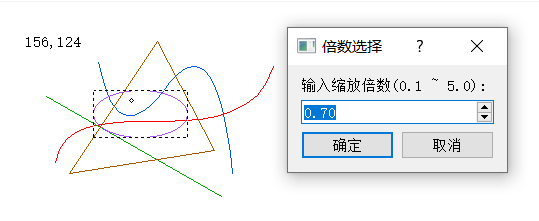

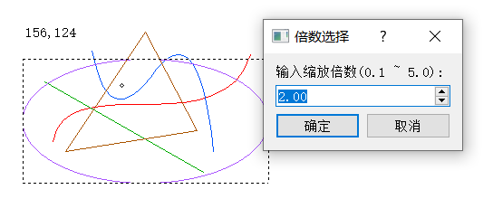

----

对于裁剪，不需要选择图元，只需要拖拽划定裁剪窗口，就会对所有线段都起效。

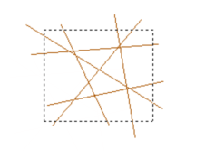

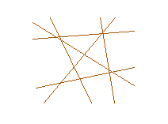

